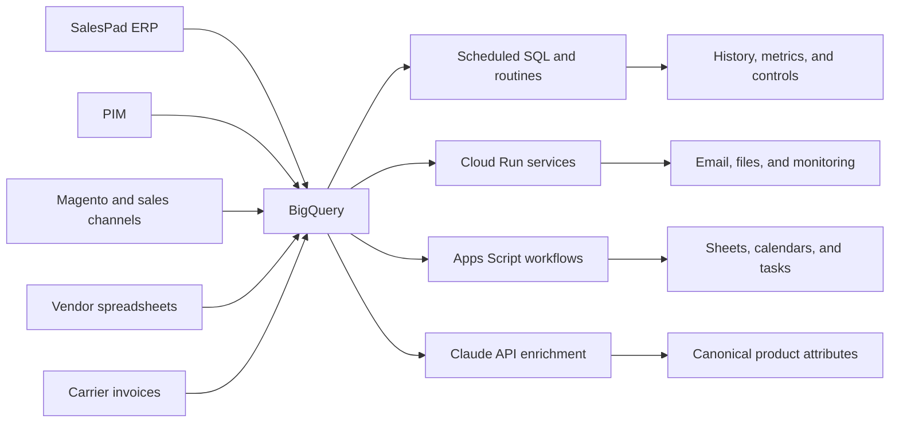

# PAS Data and Automation Platform

A production data platform built for music-retail ecommerce operations. The system connects product, inventory, sales, pricing, purchasing, promotions, catalog, and shipping data in BigQuery, then delivers operational tools through Cloud Run, Apps Script, and Google Workspace.

This repository is a public, sanitized portfolio. It documents the architecture and includes representative SQL patterns without exposing company data, credentials, or production source code.

## Impact

- Replaced recurring SalesPad and PIM exports, spreadsheet joins, and manual report distribution.
- Saves an estimated **400+ staff hours annually** across reporting, reconciliation, pricing, catalog, and purchasing workflows.
- Supports catalog QA for **4,000+ new SKUs in 2026**.
- Powers an AI-assisted product-attribute program across **25,000+ live listings**, beginning with roughly 3,000 electric-guitar SKUs.
- Standardizes promotion workflows across approximately **53 brand spreadsheets**.
- Gives purchasing and operations teams current, self-service data instead of static exports.

## Platform Scale

| Layer | Current footprint |
|---|---:|
| BigQuery | 7 datasets, 53 tables, 21 views, 5 routines |
| Scheduling | 8 BigQuery scheduled queries and 4 Cloud Scheduler workflows |
| Cloud services | 5 deployed Cloud Run services |
| Delivery | 5 path-filtered Cloud Build triggers |
| Spreadsheet automation | 33 archived brand-specific Apps Script projects |
| Warehouse activity | Approximately 8,800 query jobs per month |

## Architecture

The warehouse is the shared operational data layer. BigQuery handles storage, history, transformation, and reconciliation. Cloud Run handles scheduled or compute-heavy services. Apps Script provides spreadsheet-native interfaces for purchasing and operations. Google Sheets remains a delivery surface, not the system of record.

See [Architecture](docs/architecture.md) for the component-level design.

## Selected Systems

### Automated Operational Reporting

Scheduled ingestion and refresh workflows replaced manual exports for sell-through, margin, inventory aging, inactive products, sub-items, tracking, new items, and item receipts. Business users receive current outputs through familiar Sheets and email workflows.

### Catalog QA

A daily PIM-to-channel audit normalizes product identifiers and values before identifying missing listings and inconsistent product data. The exception-based output focuses manual review on actionable records while supporting a catalog that added more than 4,000 SKUs in 2026.

### AI-Assisted Product Attributes

A reusable `BigQuery -> Python -> Claude API -> Python -> BigQuery` workflow reads product titles, copy, and specifications, produces structured attributes, applies canonical mappings and cleanup rules, and generates upload-ready data. The program covers the full catalog of more than 25,000 live listings.

### Promotion and Price Protection

Apps Script and BigQuery synchronize promotion data from brand workbooks, resolve internal SKUs, create calendar and task reminders, generate buyer-facing feeds, and prepare import outputs. A separate receipt-lot workflow applies approved price protection without increasing inventory cost.

### Shipping Cost Intelligence

A BigQuery procedure reconciles UPS, Estes, and Ward invoices with ERP orders and tracking data. It handles multi-package and bill-of-material shipments, then calculates average shipping cost by SKU for margin analysis.

Read the [case studies](docs/case-studies.md) for the business problem, implementation, and outcome of each system.

## Representative SQL

- [Snapshot history with completeness controls](sql/snapshot_history.sql)
- [Cross-system catalog audit](sql/catalog_audit.sql)
- [Data quality assertions](sql/data_quality_assertions.sql)

These examples use generic schemas and fictional names. They demonstrate the production patterns without reproducing proprietary queries.

## Technology

- **Data:** BigQuery, SQL, partitioning, clustering, scheduled queries, stored procedures
- **Cloud and automation:** GCP, Cloud Run, Cloud Scheduler, Cloud Build, Apps Script, Python, REST APIs
- **AI:** Claude API with structured outputs, resumable batches, canonical mappings, and review queues
- **Delivery:** Google Sheets, email, Calendar, Tasks, PIM import files
- **Practices:** parameterized queries, reconciliation, freshness checks, idempotent writes, audit logs, exception handling, SOPs

## Current Engineering Roadmap

- Expand automated tests and deployment gates across all services.
- Version the complete warehouse transformation layer.
- Add stronger source-completeness checks before historical snapshots.
- Continue building reusable category schemas for catalog-wide attribute enrichment.

## About

Designed, built, and maintained by **Will Ross** using AI-assisted development. I own the business requirements, architecture, deployment, validation, documentation, and operation of the platform while continuing to deepen my SQL, Python, and testing expertise.
